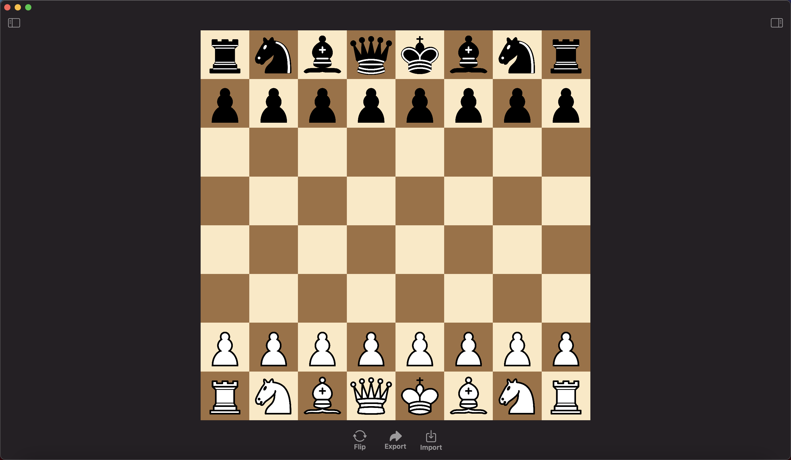

# Chess-AI
### Play it on [lichess.com](https://lichess.org/@/cabouezzi)
A fixed-depth version of the engine by [forking the lichess-bot](https://github.com/cabouezzi/chess-ai-oracle) API. Runs in Oracle Cloud Infrastructure.
### Download the [macOS Preview](https://github.com/cabouezzi/Chess-AI/blob/main/Chess%20AI.zip?raw=true)

_Research from [chessprogramming.org](https://www.chessprogramming.org/Main_Page)._ 
 
## Description
Third version of a personal project to create a chess AI from scratch in Swift. Without evaluations, the engine can reaches ~2.5m nodes per second (NPS) on the start position without bulk counting. 
## Details
The engine currently uses:
- Hybrid board representation – Bitboards and Piece List
- Move generation dependent on bitwise operations and bitmasks
- Negamax search algorithm with Alpha-Beta pruning
- Move ordering to search moves with higher likelihood of benefits
- Simple evaluation function counting material and piece-square tables
- FEN and PGN parser and serializer for importing and exporting games
- Small file containing chess openings in PGN format

Future Goals Include:
- Complete Zobrist hashing for transposition table
- Multithreading
- Complete iterative deepening
- Neural network evaluation option
- UCI protocol for CLI
- Ditch this project completely and start all over again in C++ because C++ is faster
